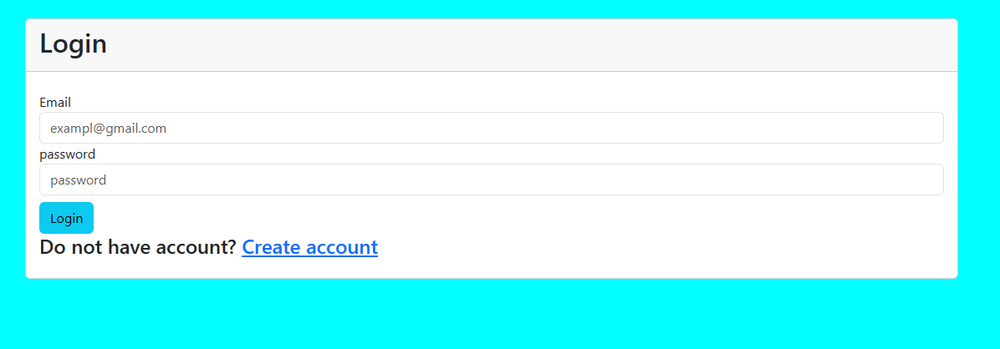
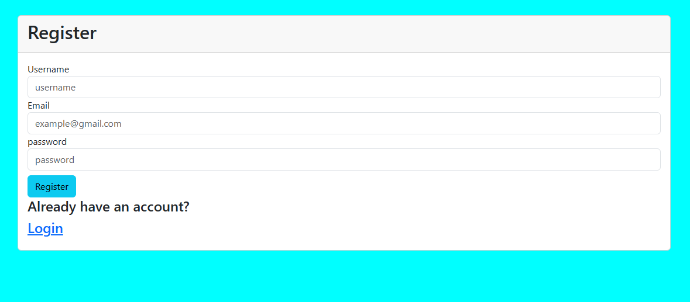
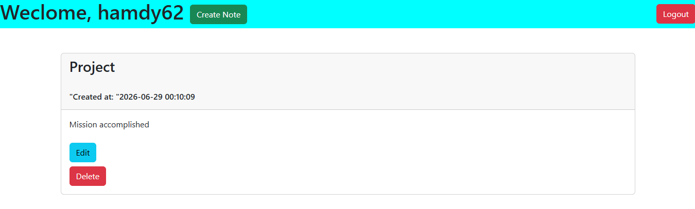
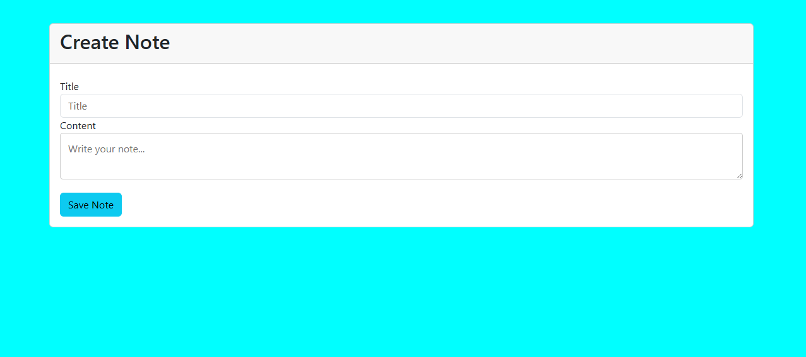

# 📝 Dockerized Note-Taking Application

A secure multi-user note-taking web application built with **PHP**, **MySQL**, **HTML**, **Bootstrap**, and **Docker**. Users can register, log in, and manage their personal notes. The application is fully containerized using **Docker** and **Docker Compose**, allowing anyone to run it with just a few commands.

---

## 📌 Features

- User Registration
- User Login & Logout
- Password Hashing
- Authentication using PHP Sessions
- Create Notes
- Edit Notes
- Delete Notes
- User Input Validation & Sanitization
- Secure Database Access using PDO Prepared Statements
- Multi-user Support
- Dockerized PHP & MySQL Environment
- Automatic Database Initialization using `init.sql`

---

## 🛠️ Technologies Used

- PHP 8.2
- MySQL 8.0
- HTML5
- Bootstrap 5
- Docker
- Docker Compose
- Apache
- PDO (PHP Data Objects)

---

## 📁 Project Structure

```text
notes_app/
│
├── database/
│   └── init.sql
│
├── includes/
│   ├── auth.php
│   ├── db.php
│   └── functions.php
│
├── create_note.php
├── dashboard.php
├── delete_note.php
├── edit_note.php
├── index.php
├── login.php
├── logout.php
├── register.php
│
├── Dockerfile
├── docker-compose.yml
├── .dockerignore
└── README.md
```

---

## 🚀 Getting Started

### Prerequisites

Make sure the following software is installed:

- Docker
- Docker Compose

Verify the installation:

```bash
docker --version
docker compose version
```

---

## Clone the Repository

```bash
git clone https://github.com/hamdy62/Note_App_with_Docker.git
cd notes_app
```

---

## Build the Containers

```bash
docker compose build
```

---

## Start the Application

```bash
docker compose up -d
```

---

## Open the Application

Visit:

```
http://localhost:8080
```

---

## Stop the Containers

```bash
docker compose down
```

---

## Remove Containers and Database Volume

```bash
docker compose down -v
```

This command removes the MySQL data volume. The next time the project starts, the database and tables will be recreated automatically using `database/init.sql`.

---

## Database Configuration

The application connects to the MySQL container using the following configuration:

| Setting | Value |
|---------|-------|
| Host | db |
| Database | NoteApp |
| Username | notesuser |
| Password | notespassword |

---

## Docker Overview

The project uses two containers:

### PHP + Apache

- Runs the PHP application
- Serves the website
- Connects to MySQL using PDO

### MySQL

- Stores users and notes
- Automatically creates the database
- Automatically creates tables from `database/init.sql`

---

## Docker Commands

Build the project

```bash
docker compose build
```

Start containers

```bash
docker compose up -d
```

View running containers

```bash
docker ps
```

View logs

```bash
docker compose logs
```

Stop containers

```bash
docker compose down
```

Delete containers and database

```bash
docker compose down -v
```

Rebuild after modifying the Dockerfile

```bash
docker compose up --build
```

---

## Security Features

- Password hashing using `password_hash()`
- Password verification using `password_verify()`
- Prepared Statements (PDO)
- Input validation
- Input sanitization
- Session-based authentication
- Authorization checks to ensure users can only manage their own notes

---

## Screenshots

## Login Page



## Register Page



## Dashboard



## Create Note




## Author

**Hamdy Alaa**

- GitHub: https://github.com/hamdy62
- LinkedIn: https://www.linkedin.com/in/hamdy-alaa/

---

## License

This project is intended for educational purposes and portfolio demonstration.
